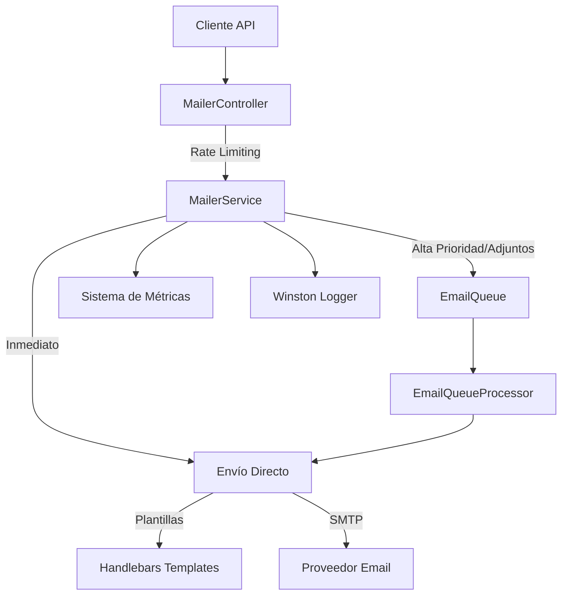

# 📧 Implementación Mejorada del Sistema de Correo Electrónico

## 📋 Tabla de Contenidos

1. [Resumen de Mejoras](#resumen-de-mejoras)
2. [Arquitectura](#arquitectura)
3. [Configuración](#configuración)
4. [Estructura de Archivos](#estructura-de-archivos)
5. [APIs Disponibles](#apis-disponibles)
6. [Plantillas de Email](#plantillas-de-email)
7. [Sistema de Colas](#sistema-de-colas)
8. [Seguridad y Rate Limiting](#seguridad-y-rate-limiting)
9. [Monitoreo y Métricas](#monitoreo-y-métricas)
10. [Variables de Entorno](#variables-de-entorno)
11. [Ejemplos de Uso](#ejemplos-de-uso)
12. [Migración desde la Versión Anterior](#migración)
13. [Troubleshooting](#troubleshooting)

## 🚀 Resumen de Mejoras

### ✅ Problemas Resueltos

| **Problema Anterior** | **Solución Implementada** |
|----------------------|---------------------------|
| ❌ Gestión básica de errores | ✅ **Manejo robusto de errores** con logging contextual y sanitización |
| ❌ Solo texto plano | ✅ **Soporte completo**: texto, HTML, plantillas Handlebars |
| ❌ Sin validaciones de email | ✅ **Validaciones exhaustivas** con transformaciones automáticas |
| ❌ Configuración estática | ✅ **Configuración dinámica** por ambiente con validaciones |
| ❌ Sin rate limiting | ✅ **Rate limiting inteligente** con múltiples niveles |
| ❌ Sin sistema de reintentos | ✅ **Sistema de reintentos** con backoff exponencial |
| ❌ Sin colas | ✅ **Sistema de colas Redis** con Bull para alta disponibilidad |
| ❌ Sin métricas | ✅ **Métricas completas** y endpoints de monitoreo |
| ❌ Credenciales expuestas | ✅ **Seguridad mejorada** con sanitización de logs |

### 🎯 Nuevas Funcionalidades

- 📎 **Archivos adjuntos** con validación automática
- 🎨 **Sistema de plantillas** con Handlebars
- 📊 **Priorización de emails** (low, normal, high)
- 🔄 **Cola de procesamiento** con Redis y Bull
- 📈 **Métricas en tiempo real** (enviados, fallidos, cola, reintentos)
- 🛡️ **Rate limiting** por endpoint con configuración granular
- 🎯 **Múltiples destinatarios** (TO, CC, BCC)
- ⚡ **Modo inmediato** para casos críticos
- 🔍 **Health checks** para monitoreo
- 🧹 **Sanitización automática** de contenido

## 🏗️ Arquitectura



## ⚙️ Configuración

### Archivo: `src/config/mailer.config.ts`

```typescript
export default registerAs('mailer', (): ExtendedMailerOptions => {
  // Validación automática de variables requeridas
  // Configuración por ambiente (dev/prod)
  // Soporte para plantillas Handlebars
  // Pool de conexiones configurables
});
```

**Características clave:**
- ✅ Validación automática de variables de entorno
- ✅ Configuración diferenciada por ambiente
- ✅ Soporte nativo para plantillas
- ✅ Pool de conexiones optimizado
- ✅ Configuración de reintentos personalizable

## 📁 Estructura de Archivos

```
src/common/mailer/
├── 📄 mailer.controller.ts      # Controlador con rate limiting
├── 🔧 mailer.service.ts         # Servicio principal mejorado
├── 🎯 email-queue.processor.ts  # Procesador de cola
├── 📋 sendmail.dto.ts           # DTO con validaciones completas
├── ⚙️ configmail.dto.ts         # DTO de configuración
└── 📁 templates/                # Plantillas de email
    ├── welcome.hbs              # Plantilla de bienvenida
    ├── password-reset.hbs       # Plantilla reset contraseña
    └── notification.hbs         # Plantilla notificaciones
```

## 🔌 APIs Disponibles

### 📨 POST `/mailer/send`
**Envío estándar de emails**

```http
POST /mailer/send
Content-Type: application/json

{
  "to": "user@example.com",
  "subject": "Asunto del email",
  "text": "Contenido en texto plano",
  "html": "<p>Contenido HTML</p>",
  "cc": ["cc@example.com"],
  "bcc": ["bcc@example.com"],
  "priority": "normal",
  "attachments": [
    {
      "filename": "documento.pdf",
      "path": "/path/to/file.pdf",
      "contentType": "application/pdf"
    }
  ]
}
```

**Rate Limit:** 10 emails/minuto

### ⚡ POST `/mailer/send-immediate`
**Envío inmediato (bypass cola)**

```http
POST /mailer/send-immediate
Content-Type: application/json

{
  "to": "urgent@example.com",
  "subject": "Email Urgente",
  "html": "<p>Este email se envía inmediatamente</p>"
}
```

**Rate Limit:** 5 emails/minuto

### 🎨 POST `/mailer/send-template`
**Envío con plantillas**

```http
POST /mailer/send-template
Content-Type: application/json

{
  "to": "user@example.com",
  "template": "welcome",
  "context": {
    "name": "Juan Pérez",
    "company": "Mi Empresa",
    "email": "juan@example.com",
    "activationLink": "https://app.com/activate/token123"
  },
  "options": {
    "priority": "high"
  }
}
```

**Rate Limit:** 20 emails/minuto

### 📊 GET `/mailer/metrics`
**Métricas del sistema**

```json
{
  "sent": 1250,
  "failed": 23,
  "queued": 15,
  "retries": 45
}
```

### 🔄 POST `/mailer/metrics/reset`
**Reset de métricas**

### 💚 GET `/mailer/health`
**Health check**

```json
{
  "status": "OK",
  "timestamp": "2024-01-15T10:30:00.000Z"
}
```

## 🎨 Plantillas de Email

### 📧 Plantilla Welcome (`welcome.hbs`)
**Variables disponibles:**
- `name` - Nombre del usuario
- `company` - Nombre de la empresa
- `email` - Email del usuario
- `registrationDate` - Fecha de registro
- `activationLink` - Link de activación
- `role` - Rol del usuario (opcional)

**Ejemplo de uso:**
```typescript
await mailerService.sendTemplateEmail(
  'user@example.com',
  'welcome',
  {
    name: 'Juan Pérez',
    company: 'Mi Empresa',
    email: 'juan@example.com',
    registrationDate: '2024-01-15',
    activationLink: 'https://app.com/activate/abc123'
  }
);
```

### 🔐 Plantilla Password Reset (`password-reset.hbs`)
**Variables disponibles:**
- `name` - Nombre del usuario
- `email` - Email del usuario
- `resetLink` - Link de reset
- `requestTime` - Hora de la solicitud
- `expirationTime` - Tiempo de expiración en horas
- `company` - Nombre de la empresa
- `supportEmail` - Email de soporte

### 🔔 Plantilla Notification (`notification.hbs`)
**Variables disponibles:**
- `title` - Título de la notificación
- `subtitle` - Subtítulo (opcional)
- `name` - Nombre del usuario
- `message` - Mensaje principal (HTML)
- `type` - Tipo de notificación (info, success, warning, error)
- `icon` - Emoji o icono (opcional)
- `details` - Objeto con detalles adicionales
- `actionButton` - Botón de acción con URL y texto
- `company` - Nombre de la empresa

## 🚀 Sistema de Colas

### Configuración Bull + Redis

```typescript
BullModule.forRootAsync({
  useFactory: (configService: ConfigService) => ({
    redis: {
      host: configService.get('REDIS_HOST', 'localhost'),
      port: configService.get('REDIS_PORT', 6379),
      password: configService.get('REDIS_PASSWORD'),
    },
    defaultJobOptions: {
      removeOnComplete: 50,  // Mantener 50 jobs completados
      removeOnFail: 20,      // Mantener 20 jobs fallidos
      attempts: 3,           // 3 intentos por defecto
      backoff: {
        type: 'exponential',
        delay: 5000,         // Delay inicial de 5s
      },
    },
  }),
  inject: [ConfigService],
})
```

### ⚡ Criterios de Cola Automática

Los emails se envían automáticamente a la cola si:
- ✅ Tienen archivos adjuntos
- ✅ Son de alta prioridad
- ✅ El modo inmediato no está activado

### 🔄 Procesamiento de Jobs

```typescript
@Process('send-email')
async handleEmailSending(job: Job<SendMailDto>) {
  // Procesamiento con contexto completo
  // Logging detallado de cada etapa
  // Manejo de errores contextualizado
}
```

## 🛡️ Seguridad y Rate Limiting

### Configuración de Throttling

```typescript
ThrottlerModule.forRootAsync({
  useFactory: () => [
    {
      name: 'short',
      ttl: 60000,      // 1 minuto
      limit: 10,       // 10 requests
    },
    {
      name: 'medium',
      ttl: 600000,     // 10 minutos
      limit: 100,      // 100 requests
    },
    {
      name: 'long',
      ttl: 3600000,    // 1 hora
      limit: 1000,     // 1000 requests
    },
  ],
})
```

### 🔒 Características de Seguridad

- ✅ **Sanitización automática** de contenido de emails
- ✅ **Validación exhaustiva** de direcciones de email
- ✅ **Rate limiting granular** por endpoint
- ✅ **Sanitización de logs** para evitar exposición de credenciales
- ✅ **Transformaciones automáticas** (lowercase, trim)
- ✅ **Validation pipes** con whitelist y forbidNonWhitelisted

### 📝 Validaciones Implementadas

```typescript
// Validaciones en SendMailDto
@IsEmail({}, { message: 'Invalid email format for destination' })
@Transform(({ value }) => value?.toLowerCase().trim())
to: string

@MinLength(1, { message: 'Subject cannot be empty' })
@MaxLength(255, { message: 'Subject too long' })
subject: string

@IsEnum(EmailPriority)
priority?: EmailPriority = EmailPriority.NORMAL
```

## 📊 Monitoreo y Métricas

### Métricas Disponibles

```typescript
interface EmailMetrics {
  sent: number;     // Emails enviados exitosamente
  failed: number;   // Emails fallidos
  queued: number;   // Emails en cola
  retries: number;  // Reintentos realizados
}
```

### 🔍 Logging Estructurado

```typescript
// Logs de contexto completo
this.logger.log(`Sending email to: ${mailData.to}`)
this.logger.log(`Email sent successfully. MessageId: ${result.messageId}`)
this.logger.error(`Email sending failed (attempt ${retryAttempt + 1}): ${error?.message}`)

// Sanitización automática de credenciales
private sanitizeError(error: any): string {
  const message = error.message || 'Unknown error'
  return message.replace(/(password|auth|token|key)=[\w\-._]+/gi, '$1=***')
}
```

## 🔧 Variables de Entorno

### ⚙️ Variables Requeridas

```bash
# SMTP Configuration (REQUERIDO)
MAILER_HOST=smtp.gmail.com
MAILER_USER=tu-email@gmail.com
MAILER_PASS=tu-app-password

# Variables Opcionales con Defaults
MAILER_PORT=587                    # Default: 587
MAILER_SECURE=false               # Default: false
MAILER_FROM=noreply@tu-empresa.com # Default: MAILER_USER
NODE_ENV=production               # Default: development

# Pool Configuration (Opcional)
MAILER_POOL=true                  # Default: false
MAILER_MAX_CONNECTIONS=5          # Default: 5
MAILER_MAX_MESSAGES=100          # Default: 100

# Retry Configuration (Opcional)
MAILER_RETRIES=3                  # Default: 3
MAILER_RETRY_DELAY=5000          # Default: 5000ms

# Redis Configuration (Para colas)
REDIS_HOST=localhost              # Default: localhost
REDIS_PORT=6379                   # Default: 6379
REDIS_PASSWORD=                   # Opcional

# Environment
ENVIRONMENT=production            # Para logs y debugging
```

### 🚨 Validación Automática

El sistema valida automáticamente las variables requeridas al inicio:

```typescript
const requiredVars = ['MAILER_HOST', 'MAILER_USER', 'MAILER_PASS']
const missingVars = requiredVars.filter(varName => !process.env[varName])

if (missingVars.length > 0) {
  throw new Error(`Missing required environment variables: ${missingVars.join(', ')}`)
}
```

## 🎯 Ejemplos de Uso

### 📧 Email Simple con Texto y HTML

```typescript
const result = await mailerService.sendMail({
  to: 'usuario@example.com',
  subject: 'Notificación Importante',
  text: 'Versión en texto plano del mensaje',
  html: '<h1>Versión HTML</h1><p>Con formato <strong>enriquecido</strong></p>',
  priority: EmailPriority.HIGH
});

console.log('Email enviado:', result.messageId);
```

### 📎 Email con Archivos Adjuntos

```typescript
const result = await mailerService.sendMail({
  to: 'usuario@example.com',
  subject: 'Documentos Adjuntos',
  html: '<p>Por favor encuentra los documentos adjuntos.</p>',
  attachments: [
    {
      filename: 'reporte.pdf',
      path: '/uploads/reportes/reporte-enero.pdf',
      contentType: 'application/pdf'
    },
    {
      filename: 'datos.xlsx',
      path: '/uploads/datos/exportacion.xlsx',
      contentType: 'application/vnd.openxmlformats-officedocument.spreadsheetml.sheet'
    }
  ]
});
```

### 🎨 Email con Plantilla Welcome

```typescript
const result = await mailerService.sendTemplateEmail(
  'nuevo-usuario@example.com',
  'welcome',
  {
    name: 'María García',
    company: 'TechCorp Solutions',
    email: 'nuevo-usuario@example.com',
    registrationDate: new Date().toLocaleDateString('es-ES'),
    activationLink: 'https://app.techcorp.com/activate?token=abc123xyz',
    role: 'Administrador',
    year: new Date().getFullYear(),
    unsubscribeLink: 'https://app.techcorp.com/unsubscribe?token=abc123xyz'
  },
  {
    priority: EmailPriority.HIGH,
    replyTo: 'soporte@techcorp.com'
  }
);
```

### 🔐 Email de Reset de Contraseña

```typescript
const result = await mailerService.sendTemplateEmail(
  'usuario@example.com',
  'password-reset',
  {
    name: 'Juan Pérez',
    email: 'usuario@example.com',
    company: 'Mi Empresa',
    resetLink: 'https://app.com/reset-password?token=secure-token-123',
    requestTime: new Date().toLocaleString('es-ES'),
    expirationTime: '24',
    year: new Date().getFullYear(),
    supportEmail: 'soporte@mi-empresa.com'
  }
);
```

### 🔔 Notificación Personalizada

```typescript
const result = await mailerService.sendTemplateEmail(
  'usuario@example.com',
  'notification',
  {
    title: 'Nuevo Pedido Recibido',
    subtitle: 'Pedido #12345 necesita tu atención',
    name: 'Carlos Rodríguez',
    company: 'E-Commerce Plus',
    type: 'success',
    icon: '🛍️',
    message: `
      <p>Has recibido un nuevo pedido que requiere procesamiento:</p>
      <ul>
        <li><strong>Cliente:</strong> Ana López</li>
        <li><strong>Total:</strong> $299.99</li>
        <li><strong>Productos:</strong> 3 items</li>
        <li><strong>Método de pago:</strong> Tarjeta de crédito</li>
      </ul>
    `,
    details: {
      'Número de Pedido': '#12345',
      'Fecha': new Date().toLocaleDateString('es-ES'),
      'Estado': 'Pendiente de procesamiento',
      'Prioridad': 'Normal'
    },
    actionButton: {
      text: 'Ver Pedido Completo',
      url: 'https://admin.ecommerce.com/pedidos/12345',
      type: 'primary'
    },
    additionalInfo: 'Este pedido debe ser procesado dentro de las próximas 2 horas.',
    year: new Date().getFullYear(),
    timestamp: new Date().toLocaleString('es-ES'),
    unsubscribeLink: 'https://admin.ecommerce.com/unsubscribe'
  }
);
```

### 📊 Monitoreo y Métricas

```typescript
// Obtener métricas actuales
const metrics = mailerService.getMetrics();
console.log('Emails enviados hoy:', metrics.sent);
console.log('Emails fallidos:', metrics.failed);
console.log('Emails en cola:', metrics.queued);
console.log('Reintentos realizados:', metrics.retries);

// Reset de métricas (útil para reportes diarios)
mailerService.resetMetrics();
```

### 🚨 Manejo de Errores Avanzado

```typescript
try {
  const result = await mailerService.sendMail(emailData);
  
  if (!result.success) {
    console.error('Error específico:', result.error);
    console.log('Intentos realizados:', result.retryAttempt);
    
    // Lógica de fallback
    await notificationService.sendSMS(fallbackMessage);
  } else {
    console.log('✅ Email enviado exitosamente');
    console.log('ID del mensaje:', result.messageId);
  }
  
} catch (error) {
  console.error('Error crítico en el sistema de email:', error);
  // Alertar al equipo de desarrollo
  await alertingService.criticalError('EmailSystem', error);
}
```

## 🔄 Migración desde la Versión Anterior

### 📋 Checklist de Migración

#### 1. ✅ Actualizar DTOs
```typescript
// ANTES (versión anterior)
{
  sendTo: 'user@example.com',
  replyTo: 'reply@example.com',
  message: 'Contenido del email',
  subject: 'Asunto'
}

// DESPUÉS (nueva implementación)
{
  to: 'user@example.com',
  replyTo: 'reply@example.com',
  text: 'Contenido del email',    // o 'html' para HTML
  subject: 'Asunto'
}
```

#### 2. ✅ Actualizar Variables de Entorno
```bash
# Agregar nuevas variables
MAILER_FROM=noreply@tu-empresa.com
REDIS_HOST=localhost
REDIS_PORT=6379
NODE_ENV=production
```

#### 3. ✅ Actualizar Imports
```typescript
// Importar nuevos tipos
import { EmailResult, EmailPriority } from './mailer/mailer.service'
import { SendMailDto } from './mailer/sendmail.dto'
```

#### 4. ✅ Actualizar Calls
```typescript
// Actualizar respuestas del servicio
const result: EmailResult = await mailerService.sendMail(emailData)
if (result.success) {
  console.log('MessageId:', result.messageId)
}
```

### 🔄 Script de Migración Automática

```bash
#!/bin/bash
# migration-script.sh

echo "🚀 Iniciando migración del sistema de email..."

# 1. Backup de archivos actuales
echo "📋 Creando backup..."
cp -r src/common/mailer src/common/mailer.backup.$(date +%Y%m%d)

# 2. Instalar nuevas dependencias
echo "📦 Instalando dependencias..."
npm install @nestjs-modules/mailer handlebars @nestjs/bull bull @nestjs/throttler redis

# 3. Validar variables de entorno
echo "⚙️ Validando configuración..."
if [ -z "$MAILER_HOST" ]; then
  echo "❌ ERROR: MAILER_HOST no está configurado"
  exit 1
fi

# 4. Test de build
echo "🔧 Verificando build..."
npm run build

echo "✅ Migración completada exitosamente!"
```

## 🐛 Troubleshooting

### ❌ Errores Comunes y Soluciones

#### 1. **Error: "Missing required environment variables"**
```bash
# Solución: Verificar variables de entorno
echo $MAILER_HOST
echo $MAILER_USER  
echo $MAILER_PASS

# Si están vacías, configurarlas:
export MAILER_HOST=smtp.gmail.com
export MAILER_USER=tu-email@gmail.com
export MAILER_PASS=tu-app-password
```

#### 2. **Error: "Redis connection failed"**
```bash
# Verificar Redis
redis-cli ping
# Debe responder: PONG

# Si no está instalado:
# Ubuntu/Debian:
sudo apt install redis-server
sudo systemctl start redis

# macOS:
brew install redis
brew services start redis

# Docker:
docker run -d -p 6379:6379 redis:alpine
```

#### 3. **Error: "Email sending failed" con Gmail**
```bash
# Solución: Usar App Passwords
# 1. Activar 2FA en Gmail
# 2. Generar App Password en: https://myaccount.google.com/apppasswords
# 3. Usar el App Password como MAILER_PASS
```

#### 4. **Error: "Rate limit exceeded"**
```typescript
// Verificar límites en mailer.controller.ts
@Throttle({ default: { limit: 10, ttl: 60000 } }) // Ajustar según necesidad

// O usar modo inmediato para casos críticos:
const result = await mailerService.sendMail(emailData, true); // true = immediate
```

#### 5. **Error: "Template not found"**
```bash
# Verificar que existe el archivo de plantilla
ls -la src/common/mailer/templates/

# Verificar permisos
chmod 644 src/common/mailer/templates/*.hbs
```

### 🔍 Debugging Avanzado

#### Habilitar Logs Detallados
```bash
# En desarrollo
export NODE_ENV=development

# Verificar logs en tiempo real
tail -f logs/app.log | grep "MailerService"
```

#### Monitoreo de Colas
```bash
# Verificar jobs en Redis
redis-cli
> KEYS bull:email:*
> LLEN bull:email:waiting
> LLEN bull:email:failed
```

#### Test de Conectividad SMTP
```typescript
// Crear endpoint de test en desarrollo
@Get('test-connection')
async testConnection() {
  try {
    await this.nestMailerService.sendMail({
      to: 'test@example.com',
      subject: 'Test Connection',
      text: 'Testing SMTP connection'
    });
    return { status: 'OK', message: 'SMTP connection successful' };
  } catch (error) {
    return { status: 'ERROR', message: error.message };
  }
}
```

### 📊 Métricas de Performance

#### Monitoreo Recomendado
```typescript
// Implementar en un cron job o endpoint
async getHealthReport() {
  const metrics = this.mailerService.getMetrics();
  const queueCounts = await this.emailQueue.getJobCounts();
  
  return {
    metrics,
    queue: {
      waiting: queueCounts.waiting,
      active: queueCounts.active,
      completed: queueCounts.completed,
      failed: queueCounts.failed
    },
    performance: {
      successRate: (metrics.sent / (metrics.sent + metrics.failed)) * 100,
      avgRetries: metrics.retries / (metrics.sent + metrics.failed),
      queueBacklog: queueCounts.waiting + queueCounts.active
    }
  };
}
```

---

## 🎉 Conclusión

Esta implementación mejorada del sistema de correo electrónico proporciona:

- ✅ **Robustez**: Manejo completo de errores y reintentos
- ✅ **Escalabilidad**: Sistema de colas para alta disponibilidad  
- ✅ **Seguridad**: Rate limiting y sanitización automática
- ✅ **Flexibilidad**: Múltiples formatos y plantillas
- ✅ **Monitoreo**: Métricas completas y health checks
- ✅ **Facilidad de uso**: APIs claras y documentación completa

El sistema está listo para producción y puede manejar desde emails simples hasta campañas masivas con alta disponibilidad y observabilidad completa.

---

**Versión:** 2.0.0  
**Fecha:** Enero 2024  
**Autor:** Sistema Mejorado de Email  
**Licencia:** MIT